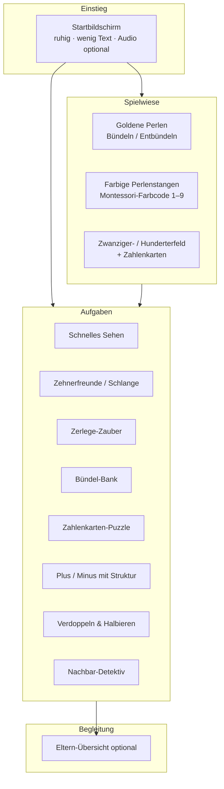

# Konzept: Grok's Zahlenwerkstatt

**Forschungs- und Konzeptpapier**  
Kinder-Mathe-Website · Zahlenraum bis 100 · Ablösung vom zählenden Rechnen  
Stand: Oktober 2026 · Für Matthias Sütterlin (Elternsicht + Design)

---

## 1. Anlass und Ziel

Die Tochter (~7 Jahre, 2. Klasse, Deutschland) zählt Mengen noch oft einzeln ab (*zählendes Rechnen*). Die Partnerin arbeitet an einer Montessori-Schule und schätzt die klassischen Montessori-Mathematikmaterialien. **Grok's Zahlenwerkstatt** soll helfen, ein echtes Zehnersystem- und Zahlverständnis aufzubauen: Mengen in **5er- und 10er-Bündeln sehen**, Zahlen als **Zusammensetzung aus Teilen** denken und vom Abzählen einzelner Objekte wegzukommen.

Zwei Produktteile:

1. **Spielwiese** – freies Erkunden des Dezimalsystems (Sandbox)
2. **Aufgaben / Spiele** – spielerische Aufgaben mit Ziehen, Zusammenführen, Zerlegen (Maus + Finger auf dem iPad)

Später: statische Website im öffentlichen GitHub-Repo `matthiassuetterlin/groks-zahlenwerkstatt` (dieses Dokument ist nur Konzept, kein Repo-Push).

---

## 2. Forschungsgrundlagen

### 2.1 Warum zählendes Rechnen problematisch wird

Zählen ist zu Schulbeginn normal. Verfestigt es sich aber über Klasse 1 hinaus, fehlt oft das **Teil-Ganzes-Verständnis**: Zahlen werden nicht als Zusammensetzungen aus anderen Zahlen gedacht, sondern Aufgabe für Aufgabe einzeln abgezählt. Das erschwert Stellenwertverständnis, Zehnerübergang und flexible Strategien.

Laut Gaidoschik und der deutschsprachigen Fachdidaktik (PIKAS, MaCo/DZLM, Wartha & Schulz) braucht die Ablösung:

- **strukturierte Mengenwahrnehmung** / quasi-simultane Erfassung (nicht jedes Plättchen zählen)
- **Teil-Ganzes-Konzept** und automatisierte Zerlegungen (bes. zur 5 und zur 10)
- **Zahl- und Aufgabenbeziehungen** (Verdoppeln, Nachbarn, „Zusammen 10“, Kraft der Zehn)
- gezieltes **Ableiten** statt nur Weiterzählen

Quellen: [PIKAS-mi – Beziehungen herstellen](https://pikas-mi.dzlm.de/node/123), [MaCo Ablösung vom zählenden Rechnen (PDF)](https://maco.dzlm.de/sites/maco/files/material-lul/dzlm_maco_prim_ablzaehlendrechnen_221109.pdf), [Gaidoschik bei PIKAS (PDF)](https://pikas.dzlm.de/pikasfiles/uploads/upload/Material/Haus_3_-_Umgang_mit_Rechenschwierigkeiten/IM/Informationstexte/Beitrag_Gaidoschik.pdf), [Wartha & Schulz / SINUS Handreichung](http://www.sinus-an-grundschulen.de/fileadmin/uploads/Material_aus_SGS/Handreichung_WarthaSchulz.pdf).

### 2.2 Kernideen der deutschen Grundschuldidaktik (relevant für Klasse 2)

| Idee | Kurz | Bedeutung für die Website |
|------|------|---------------------------|
| **Kraft der Fünf** | Mengen als 5+… sehen (Fingerbild, Hand) | Fünfer-Stapel / Blitze, die 5 auf einmal setzen |
| **Kraft der Zehn / Zehnerbündelung** | 10 Einer = 1 Zehner | Automatisches oder gestisches Bündeln |
| **strukturierte Anzahlerfassung** | Zwanziger-/Hunderterfeld, Rechenrahmen | Felder mit klarer 5er/10er-Struktur |
| **Teil-Ganzes / Zerlegen** | z. B. 8 = 5+3 = 4+4 | Zerlege-Spiele, Schlangen-Partner |
| **Verdoppeln / Halbieren** | Kernaufgaben | eigene Spieltypen |
| **Nachbaraufgaben** | +1/−1 von bekannten Fakten | Progression ohne Auswendiglernen isolierter Fakten |
| **Zehnerübergang** | z. B. 8+5 über 8+2+3 | Aufgabenraum bis 100 in Klasse 2 |

PIKAS betont: Zerlegungen müssen **strukturiert** erkennbar sein – ungeordnete „Schüttelboxen“ können wieder zum Zählen einladen ([pikas-mi](https://pikas-mi.dzlm.de/node/123)).

### 2.3 Montessori-Mathematikmaterialien (Alter ca. 6–8)

Montessori führt vom **Konkreten zum Abstrakten**. Für das Ziel „weg vom Zählen, hin zu Struktur und Stellenwert“ besonders relevant:

#### Frühe Mengen und Farben

- **Zahlenstäbe (Number Rods)** – Länge = Anzahl, sensorisch
- **Spindelkästen** – Anzahlen in Fächer legen, auch die Null
- **Farbige Perlentreppe (Short / Colored Bead Stair)** – Stangen 1–9 in festem Farbcode:
  - 1 rot · 2 grün · 3 rosa · 4 gelb · 5 hellblau · 6 lila · 7 weiß · 8 braun · 9 dunkelblau  
  (übliche AMI-/NAMC-Farbzuordnung; Hersteller können leicht variieren)

#### Dezimalsystem / Goldenes Perlenmaterial

- **1 goldene Perle** = Einer  
- **Zehnerstange** (10 Perlen)  
- **Hunderterquadrat** (10 Zehner)  
- **Tausenderwürfel** (10 Hunderter)  

Maßstab und Gewicht machen das Bündeln greifbar: 10 Einer ↔ 1 Zehner usw.

#### Stellenwert und Übergang zur Abstraktion

- **Zahlenkarten / Place-value cards** – farbig: Einer grün, Zehner blau, Hunderter rot, Tausender wieder grün; oft mit „versteckter Null“ beim Übereinanderlegen (z. B. 1000 + 400 + 20 + 3 → 1423)
- **Seguin-Boards (Teen-/Ten-Boards)** – 10 + Einerkarte über der Null → 11–19; analog Zehnerbretter bis 99
- **Markenspiel (Stamp Game)** – gleich große „Briefmarken“ 1 / 10 / 100 / 1000 in denselben Stellenwertfarben; Operationen abstrakter als beim Goldenen Material
- **Schlangenspiel (Snake Game)** – farbige Stangen zu Zehnern kombinieren, gegen goldene Zehner eintauschen → „Zehnerfreunde“ / Bonds of ten
- **Perlenketten (Bead Chains)** – lineare Darstellung von Quadrat- und Kubikzahlen / Zehnerpotenzen
- **Additions-/Subtraktions-Streifenbretter** – Faktenarbeit mit Streifen
- **Kleiner Perlenrahmen (Small Bead Frame)** – Stellenwertrechnung bis Tausender, Übergang zur schriftlichen Form

**Stellenwert-Farben (Montessori):** Einer **grün**, Zehner **blau**, Hunderter **rot**, Tausender **grün** (Muster wiederholt sich in höheren Hierarchien).

Quellen: [Montessori Foundation – Golden Beads & Stamp Game](https://stage.montessori.org/those-mysterious-montessori-materials/), [VFKH – Golden Bead Decimal System](https://www.vfkh.org/primary-limerick/golden-bead-decimal-system/), [Montessori Album – Stamp Game](https://www.montessorialbum.com/montessori/index.php/Stamp_Game), [NAMC Short Bead Stair (PDF)](https://wdcmta.littleclarion.com/MONTESSORI%20HANDS-ON%20TRAINING%20VIDEOS/MONTESSORI%20ARTICLES/Mathematics/namc-about-the-short-bead-stair.pdf), [Montessori Mom – Snake Game](https://montessorimom.com/snake-game-addition/).

### 2.4 Montessori-Prinzipien für das Design

| Prinzip | Bedeutung für Grok's Zahlenwerkstatt |
|---------|--------------------------------------|
| **Konkret → abstrakt** | Erst Perlen/Stangen/Felder, dann Marken/Zahlenkarten, dann reine Zahl |
| **Isolation of difficulty** | Pro Aktivität nur *eine* neue Hürde (z. B. nur Bündeln, oder nur Zehnerübergang) |
| **Control of error** | Selbstkontrolle im Material (Passung, Partner zu 10, visuelle Prüfung) – kein „Falsch!“-Bestrafen |
| **Sensorisch zuerst** | Farben, Größen, Einrasten, klare Strukturen |
| **Freie Wahl & Wiederholung** | Spielwiese ohne Pflicht; Aufgaben wiederholbar |
| **Drei-Perioden-Lektion** | (1) Benennen/zeigen → (2) „Zeig mir …“ → (3) Kind benennt selbst – digital: kurze Tutorials, dann Erkennen, dann Selbstbenennen (Audio optional) |

### 2.5 Digitale Manipulative: Chancen und Fallstricke

**Forschung (Moyer-Packenham u. a.):** Virtuelle Manipulative können Lernen unterstützen, wenn sie u. a. **fokussieren/einschränken** (*focused constraint*), Darstellungen **gleichzeitig verknüpfen** (*simultaneous linking*), präzise und effizient sind und motivieren – Metaanalysen zeigen insgesamt moderate Effekte.

**Deutscher Spezialfall – Ladel & Kortenkamp:** Beim realen Zwanzigerfeld müssen Kinder Plättchen oft *einzeln* legen – das fördert weiter das Zählen. Digital können Kinder **Fünferpäckchen mit einem Griff** setzen, die danach trotzdem einzeln sichtbar und veränderbar bleiben. Die Wahl „1 oder 5?“ zwingt zur Zerlegung *vor* dem Handeln. Das ist ein zentrales Designmuster für diese Website.

**Gute digitale Vorbilder (Orientierung, keine Kopie):** Rechenfeld-/Zahlenfeld-Apps, strukturierte Zwanzigerfelder, explizite Zerlege-Apps, Montessori-Bead-Apps.

**Fallstricke vermeiden:**

- Apps, bei denen man **jedes Objekt einzeln anklicken** muss → verstärken Zählen
- Belohnungsregen, Timer-Druck, Werbung, Login → ablenkend
- Unstrukturierte Haufen ohne 5er/10er-Raster
- Sofortiges „Falsch“ ohne Möglichkeit zur Selbstkorrektur

Quellen: [Moyer et al. – What Are Virtual Manipulatives? (NCTM)](https://pubs.nctm.org/view/journals/tcm/8/6/article-p372.xml), [Moyer-Packenham & Westenskow Metaanalyse (ERIC)](https://eric.ed.gov/?id=EJ1154970), [Ladel & Kortenkamp – Virtuell-enaktives Arbeiten mit der Kraft der Fünf (PDF)](https://cermat.org/sites/default/files/LadelKortenkamp-VAGKF-2009a.pdf), [Rechenfeld App](https://rechenfeld.de/).

---

## 3. Didaktischer Kern (was die Seite *bauen* muss)

### 3.1 Die wenigen Schlüssel-Einsichten

1. **5 und 10 sind sofort sichtbare Strukturen** – nicht 7 einzelne Punkte, sondern „eine volle Hand und zwei“.
2. **Zahlen sind Zusammensetzungen aus Teilen** (Teil-Ganzes) – 14 = 10+4 = 5+5+4 = 7+7 …
3. **Bündeln und Entbündeln** – 10 Einer ↔ 1 Zehner; später 10 Zehner ↔ 1 Hunderter.
4. **Stellenwert** – dieselbe Ziffer bedeutet je nach Position etwas anderes (grün/blau/rot).
5. **Beziehungen zwischen Aufgaben** – aus 5+5 folgt 5+6; aus 8+2 folgt 8+5 über den Zehnerstopp.

### 3.2 Wie das Design aktives Abzählen *verhindert*

| Maßnahme | Wirkung |
|----------|---------|
| Mengen immer in **5er-/10er-Struktur** zeigen (Feld, Stange, Rahmen) | Quasi-simultanes Sehen statt Punkt-für-Punkt |
| **Kurzes Aufblitzen** („Schnelles Sehen“, 1–2 s) in manchen Spielen | Zählen wird unmöglich/unnötig |
| **Ganze Stangen/Bars ziehen**, nicht einzelne Perlen (außer bewusst beim Entbündeln) | Handlung = Menge, nicht Zählreihe |
| **Einrasten / Snap**: 10 Einer → Zehnerstange; 2 Fünfer → Zehner | Bündelung wird erlebt |
| **Wahl „1 oder 5?“** vor dem Setzen (Ladel/Kortenkamp) | Zerlegung vor der Handlung |
| Partner zu 10 **visuell leuchten** (Schlangenprinzip) | Control of error ohne Tadel |
| Zahlenkarten **stapeln** mit sichtbarer Struktur | Stellenwert ohne Auswendiglernen |

---

## 4. Überblick der Website-Struktur

**Lernpfad (grobes Level-Mapping Klasse 2):**

| Stufe | Zahlenraum | Fokus |
|-------|------------|--------|
| A | bis 10 | Kraft der Fünf, Zerlegen, Partner zu 10 |
| B | bis 20 | Zwanzigerfeld, Zehnerübergang, Teen-Zahlen (10+n) |
| C | bis 100 | Zehnerstangen, Hunderterfeld, Stellenwert, Addition/Subtraktion mit Bündeln |
| D (optional) | Vorbereitung 1×1 | gleiche Stangen mehrmals → Rechtecke / Ketten-Idee |

---

## 5. Teil 1 – Spielwiese (Free-Play)

Drei konkrete Werkzeuge, abgeleitet aus Montessori + deutscher Didaktik. Alle touch-first, große Ziele, Einrasten, Calm Design.

### 5.1 Werkzeug A: Goldene Perlen-Bank (Dezimalsystem)

**Vorbild:** Goldenes Perlenmaterial.

**Auf dem Tisch:** Schalen mit Einern (goldene Perlen), Zehnerstangen, später Hunderterquadraten. Bank-Bereich zum „Wechseln“.

**Interaktionen:**

- Einer einzeln oder als **Fünfer-Griff** (zwei Optionen) auf die Matte ziehen
- **10 Einer** nebeneinander/übereinander → automatisches oder Wisch-Geste-**Bündeln** zu einer Zehnerstange (Snap + kurzer Sound)
- Zehnerstange **auseinanderziehen** (Pinch/Split) → 10 Einer
- Später: 10 Zehner → Hunderterquadrat
- Optional Zahlenkarte daneben legen; Summe wird live als Ziffern in Stellenwertfarben angezeigt

**Lernziel:** Bündelung und „10 von dieser Art = 1 der nächsten“.

### 5.2 Werkzeug B: Farbige Perlenstangen (Perlentreppe & Schlange)

**Vorbild:** Colored Bead Stair + Snake Game.

**Auf dem Tisch:** Stangen 1–9 im Montessori-Farbcode; goldene Zehnerstangen; optional schwarz-weiße Reststangen.

**Interaktionen:**

- Stangen als **Ganzes** ziehen (kein Einzelperlen-Ziehen in diesem Modus)
- Zwei Stangen aneinander → wenn Summe 10, **goldener Blitz** / Tausch gegen goldene 10 (Control of error)
- Freie Schlange legen und „in Gold verwandeln“
- Treppe 1–9 bauen (Selbstkontrolle: glatte Diagonale)

**Lernziel:** Mengen als farbig kodierte Einheiten; Partner zu 10; Kraft der Fünf (hellblaue 5er-Stange besonders sichtbar).

### 5.3 Werkzeug C: Strukturfeld + Zahlenkarten

**Vorbild:** Zwanziger-/Hunderterfeld (Wittmann u. a.) + Montessori-Zahlenkarten / Seguin-Idee.

**Interaktionen:**

- Plättchen in **Fünferstapeln** oder einzeln setzen (Wahl vor dem Zug)
- Feld zeigt klare 5er/10er-Linien; Füllung „schnappt“ in Struktur
- **Zahlenkarten** (grün/blau/rot) stapeln: Karte „30“ + „4“ → sichtbar 34; Nullen „verstecken“ sich unter der oberen Karte
- Umschalten 20er ↔ 100er-Feld

**Lernziel:** strukturierte Anzahlerfassung + Stellenwert-Schreibweise.

---

## 6. Teil 2 – Aufgaben / Spiele (5–8 Typen)

Prinzipien für alle Spiele:

- **Selbstkontrolle** statt Bestrafen (Material „stimmt“ oder Partner leuchtet)
- Kurzes positives Feedback, keine Punkte-Explosion
- Wiederholbar; Schwierigkeit steigt mit Zahlenraum
- Wenig Text; Audio-Hinweise optional
- Finger und Maus gleichwertig (Pointer Events)

### Spiel 1 – Schnelles Sehen (Blitz)

- Kurz strukturierte Menge im Feld/als Stangen → Kind tippt oder legt die Zahl
- Progression: bis 10 → 20 → 100 (Zehnerstangen + Einer)
- Verhindert Zählen durch Zeitfenster; Fehler → länger anschauen, erneut versuchen

*Beispiel:* Blitz zeigt 3 Zehner + hellblaue 5 → Kind wählt 35.

### Spiel 2 – Zehnerfreunde (digitale Schlange)

- Gegebene Stange (z. B. 7) → passende Partnerstange finden (3)
- Oder: bunte Schlange in goldene Zehner verwandeln
- Control of error: nur korrekte Paare tauschen sich in Gold

*Beispiel:* „Mach die 9 gold. Was fehlt bis 10?“

### Spiel 3 – Zerlege-Zauber

- Zielzahl (z. B. 8) auf möglichst wenigen „Griffen“ legen (1er- und 5er-Stapel)
- Explizit nach Ladel/Kortenkamp: kürzester Weg macht Kraft der Fünf spürbar
- Variante: alle Zerlegungen von 10 finden (systematisch)

*Beispiel:* „Lege 12 – mit so wenigen Klicks wie möglich.“

### Spiel 4 – Bündel-Bank

- Kind bekommt „zu viele“ Einer (z. B. 14) → muss zur Bank und in Zehner + Einer wechseln
- Umgekehrt: Zehner „auflösen“, um abzuziehen
- Vorbereitung Zehnerübergang und Stellenwert

*Beispiel:* „Du hast 23 Einer. Wechsle, bis du möglichst große Stücke hast.“

### Spiel 5 – Zahlenkarten-Puzzle

- Menge legen → passende gestapelte Karten wählen (oder umgekehrt)
- Teen-Modus: feste „10“-Karte, Einer über die Null schieben (Seguin)
- Farben: Einer grün, Zehner blau

*Beispiel:* Goldene Darstellung 2 Zehner + 6 → Karten 20 + 6 stapeln.

### Spiel 6 – Plus & Minus mit Struktur

- Aufgabe als Zahlensatz + strukturierte Darstellung
- Kind verschiebt **ganze Stangen/Fünfer**, nicht Einzelschritte auf der Zahlreihe
- Zehnerstopp: bei 8+5 zuerst +2 bis 10, Rest +3 (visuell geführt, Isolation of difficulty)

*Beispiel Stufe B:* 8+5 am Zwanzigerfeld.  
*Beispiel Stufe C:* 47+26 mit Zehnerstangen und Bündeln.

### Spiel 7 – Doppel & Halb

- Menge verdoppeln (Spiegeln / Stempel) oder halbieren (Teilen)
- Kernaufgaben für Ableiten (6+6 → 6+7)

*Beispiel:* „Doppel die hellblaue 5.“ → goldene 10 entsteht.

### Spiel 8 – Nachbar-Detektiv (optional)

- Bekannte Aufgabe gegeben (5+5=10) → Nachbaraufgabe lösen (5+6, 4+5)
- Macht Beziehungen statt Isolierfakten stark (Gaidoschik: Denken in Zusammenhängen)

---

## 7. Lernpfad und Curriculum-Bezug (Klasse 2)

Typische Erwartungen im deutschen Zahlenraum bis 100 (vereinfacht, ohne Bundesland-Detail):

1. Zahlen bis 100 darstellen, ordnen, zerlegen  
2. Stellenwert (Zehner/Einer)  
3. Addition/Subtraktion auch mit Zehnerübergang  
4. Nutzen von Rechenvorteilen und Beziehungen  
5. Optional: erste Multiplikationsvorstellungen (gleichmäßige Bündel)

**Mapping auf Grok's Zahlenwerkstatt:**

| Curriculum | Spielwiese | Spiele |
|------------|------------|--------|
| ZR 10, Kraft der 5 | B Perlenstangen, C Feld | 1, 2, 3, 7 |
| ZR 20, Zehnerübergang | C Zwanzigerfeld, A Bündeln | 2, 4, 5, 6 |
| ZR 100, Stellenwert | A + C Hunderter | 1, 4, 5, 6, 8 |
| 1×1-Vorbereitung | B gleiche Stangen legen | 7 + Rechteck-Modus später |

---

## 8. UX- und visuelle Richtung

**Für wen:** Kind ~7 Jahre, iPad + Desktop; Eltern lesen das Konzept, Kind bedient die Seite.

**Gestaltung (passend zu Interior-/Design-Anspruch):**

- **Calm Minimal:** viel Weißraum, weiche Schatten, keine lauten Gradienten, keine Ads
- **Montessori-Farben** konsequent (Perlen 1–9 + Stellenwert grün/blau/rot)
- **Große Touch-Targets** (≥ 44 px, eher 56–64 px für Stangen)
- **Wenig Text**; Piktogramme; **optionales Audio** (kurze deutsche Ansagen)
- **Kein Login, keine Werbung**, offline-fähig als Static Site (Service Worker später optional)
- **Maskottchen „Grok“** nur dezent: kleiner Werkstatt-Charakter (z. B. freundliche Figur mit Zollstock/Perlen), erscheint in Tutorials und bei Selbstkontrolle – nicht als Gamification-Dauerfeuer
- Name „Zahlenwerkstatt“ → Metapher Werkbank, Schubladen, Bank-Schalter – handwerklich, ruhig, hochwertig

**Feedback:** sanftes Einrasten, kurzes Aufleuchten korrekter Partner, „Nochmal anschauen“ statt rotem X.

**Barriere / Lesen:** Kind liest noch langsam → Aufgaben möglichst visuell startbar; Elternmenü klar beschriftet.

---

## 9. Eltern-Ansicht (optional, Phase 2)

- Einfache Übersicht: welche Spieltypen genutzt, Zahlenraum, „Selbstkontrolle bestanden“
- Keine Noten, keine Rankings
- Kurze Tipps: „Zuhause: Mengen in Fünfer-Gruppen legen; fragen: *Wie siehst du die 8?*“
- Hinweis: digitales Material ergänzt, ersetzt nicht physische Montessori-/Schulmaterialien

---

## 10. Technik-Skizze (später)

- **Static Site:** HTML + CSS + Vanilla JS (oder leichtes Framework)
- **Pointer Events** für Drag auf iPad und Maus
- Hosting: **GitHub Pages** im Repo `matthiassuetterlin/groks-zahlenwerkstatt`
- Assets: SVG/Canvas für Perlen und Felder (scharf auf Retina)
- LocalStorage für Fortschritt (kein Backend)
- Keine Tracking-Scripts

---

## 11. MVP-Vorschlag (kleinster wertvoller erster Bau)

**Ziel des MVP:** In 1–2 Wochen spürbar üben: *Mengen in 5/10 sehen und bündeln* – ohne Login, auf dem iPad.

### MVP enthält

1. **Spielwiese – Werkzeug C light:** Zwanzigerfeld mit 1er- und 5er-Griff (Ladel/Kortenkamp-Prinzip) + Live-Zahl
2. **Spielwiese – Werkzeug A light:** Einer ↔ Zehnerstange bündeln/entbündeln (bis 20 oder 30)
3. **Zwei Spiele:**  
   - Schnelles Sehen (ZR 10→20)  
   - Zerlege-Zauber („kürzester Weg“ mit 5er-Stapeln)
4. Startseite mit zwei Kacheln: Spielwiese / Aufgaben; dezentes Grok-Icon
5. Responsive Layout, Touch-Drag, kein Backend

### MVP enthält bewusst *noch nicht*

- Hunderterfeld, Markenspiel, volles Schlangenspiel, Eltern-Dashboard, Audio, Service Worker, Multiplikation

### Danach (V1)

- Farbige Perlenstangen + Zehnerfreunde  
- Zahlenkarten-Stapeln  
- Plus/Minus mit Zehnerstopp  
- Ausbau ZR 100  

---

## 12. Offene Fragen an Matthias (und Partnerin)

1. **Zahlenraum-Start:** Soll das MVP bei ZR 10–20 bleiben (sichere Ablösung vom Zählen) oder möglichst schnell bis 100 gehen (aktueller Klassenstoff)?
2. **Montessori-Treue:** Wie streng die klassischen Perlenfarben und Stellenwertfarben? (Design-Abstimmung: hellblau für die 5 vs. evtl. etwas kräftigere Palette für iPad-Lesbarkeit)
3. **Sprache & Audio:** Nur visuelle Steuerung zuerst, oder von Anfang an kurze Audio-Ansagen (und wer spricht ein)?
4. **Begleitung zu Hause:** Soll die Partnerin konkrete „Montessori-Lektionen“ (Drei-Perioden) digital gespiegelt haben, oder eher freie Spielwiese + wenige klare Spiele?
5. **Maskottchen:** Wie präsent darf „Grok“ sein – kaum sichtbar / sanfter Begleiter / erzählende Werkstatt-Figur?

---

## 13. Quellen (Linkliste)

### Deutsche Mathematikdidaktik / Ablösung vom zählenden Rechnen

- PIKAS-mi: [Beziehungen herstellen](https://pikas-mi.dzlm.de/node/123)
- MaCo/DZLM: [Ablösung vom zählenden Rechnen (PDF)](https://maco.dzlm.de/sites/maco/files/material-lul/dzlm_maco_prim_ablzaehlendrechnen_221109.pdf)
- MaCo: [Anzahlen strukturiert darstellen im ZR 20 (PDF)](https://maco.dzlm.de/sites/maco/files/material-lul/dzlm_difprim_ablzaehlendrechnen_bs3_didkomm_240322.pdf)
- PIKAS: [Modul 3.3 Nicht-zählende Rechenstrategien (PDF)](https://pikas.dzlm.de/pikasfiles/uploads/upload/Material/Haus_3_-_Umgang_mit_Rechenschwierigkeiten/FM/Modul_3.3/Modul_3.3_Erarbeitung_nicht-zaehlender_Rechenstrategien.pdf)
- Gaidoschik: [Beitrag zu Rechenstrategien im 1. Schuljahr (PDF)](https://pikas.dzlm.de/pikasfiles/uploads/upload/Material/Haus_3_-_Umgang_mit_Rechenschwierigkeiten/IM/Informationstexte/Beitrag_Gaidoschik.pdf)
- Wartha & Schulz: [SINUS-Handreichung Aufbau von Grundvorstellungen (PDF)](http://www.sinus-an-grundschulen.de/fileadmin/uploads/Material_aus_SGS/Handreichung_WarthaSchulz.pdf)
- Ladel & Kortenkamp: [Virtuell-enaktives Arbeiten mit der Kraft der Fünf (PDF)](https://cermat.org/sites/default/files/LadelKortenkamp-VAGKF-2009a.pdf)

### Montessori-Materialien

- [Montessori Foundation: Golden Beads & Stamp Game](https://stage.montessori.org/those-mysterious-montessori-materials/)
- [VFKH: Golden Bead Decimal System & Stamp Game](https://www.vfkh.org/primary-limerick/golden-bead-decimal-system/)
- [Montessori Album: Stamp Game](https://www.montessorialbum.com/montessori/index.php/Stamp_Game)
- [NAMC: Short Bead Stair (PDF)](https://wdcmta.littleclarion.com/MONTESSORI%20HANDS-ON%20TRAINING%20VIDEOS/MONTESSORI%20ARTICLES/Mathematics/namc-about-the-short-bead-stair.pdf)
- [NAMC: Golden Bead Material (PDF)](https://wdcmta.littleclarion.com/MONTESSORI%20HANDS-ON%20TRAINING%20VIDEOS/MONTESSORI%20ARTICLES/Mathematics/namc-about-the-golden-bead-material.pdf)
- [Montessori Mom: Snake Game (Addition)](https://montessorimom.com/snake-game-addition/)
- [Montessori Math: Colored Bead Stair](https://montessori-math.org/lessons/bead-stair-intro)
- [The Montessori Room: Coloured Bead Stairs Farben](https://themontessoriroom.com/products/coloured-bead-stairs-1-9)
- AMS: [Core Components of Montessori Education](https://amshq.org/the-ams-difference/core-components-of-montessori/)
- [Three-Period Lesson (Montessori Parenting)](https://montessoriparenting.org/the-three-period-lesson/)

### Digitale Manipulative

- Moyer, Bolyard, Spikell: [What Are Virtual Manipulatives? (NCTM)](https://pubs.nctm.org/view/journals/tcm/8/6/article-p372.xml)
- Moyer-Packenham & Westenskow: [Effects of Virtual Manipulatives (ERIC EJ1154970)](https://eric.ed.gov/?id=EJ1154970)
- Orientierung Apps: [Rechenfeld](https://rechenfeld.de/), [urff.app Rechenfeld](https://urff.app/rechenfeld/)

---

*Ende des Konzepts. Nächster Schritt nach Klärung der offenen Fragen: Wireframes / visuelles Moodboard, dann MVP-HTML-Prototyp.*
